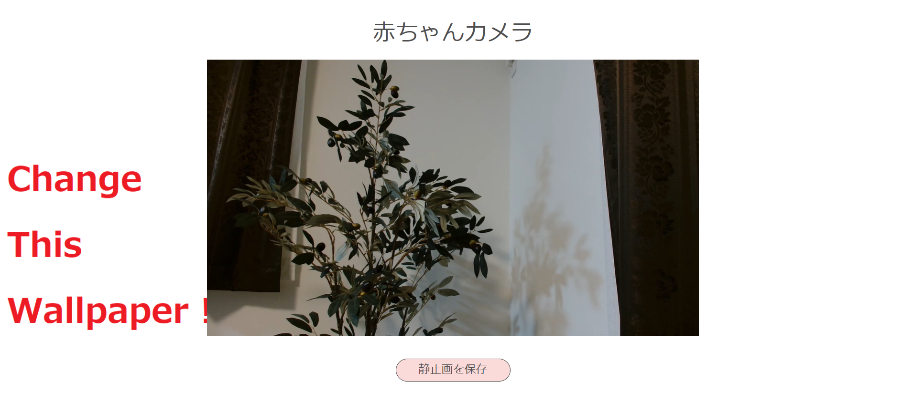
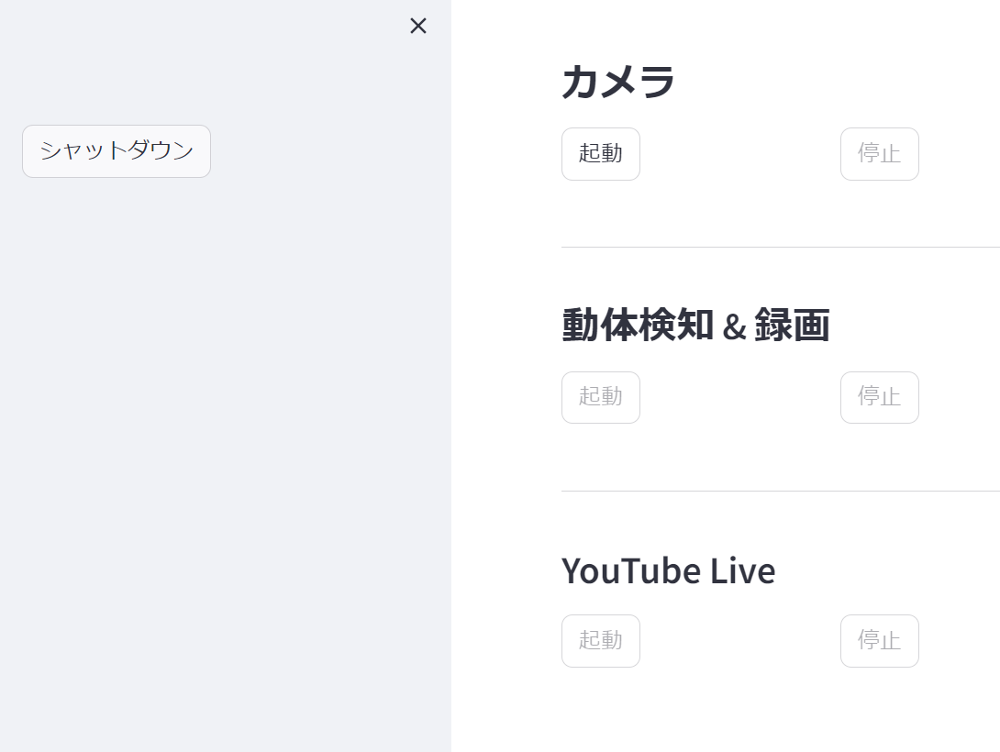

# 多機能赤ちゃんカメラ
  

  
## 1. 概要
  
ラズベリーパイ & USBカメラで動作する赤ちゃんカメラです。ラズベリーパイは、H.264をGPUでハードウェアエンコードできるモデルを推奨します。  
  
<br>
  
以下の機能を持ちます。  
  
|機能|内容|
|:---|:---|
|Webブラウザによる複数端末での同時視聴|Webブラウザを用いて、映像を低遅延で視聴できます。複数端末(スマートフォン、タブレット、ノートPCなど)で、同時に視聴可能です。|
|スクリーンショット機能|映像のスクリーンショットを保存できます。|
|動体検知 & 録画|動体を検知したら、映像を録画します。|
|YouTubeライブ配信|Youtubeで映像をライブ配信することができます。|
  
<br>
  
本ソフトウェアは5つのDockerコンテナで構成されてします。  
  
|コンテナ名|機能|
|:---|:---|
|v4l2loopback|1つのビデオデバイスの映像を、2つの仮想デバイスに流します。(encoderコンテナとmotion_detectionコンテナの2つのコンテナが、ビデオデバイスを同時に使用するため)|
|encoder|映像をH.264 & Opusにエンコードして、ストリーミングサーバーに入力します。|
|server|ストリーミングサーバーです。ユーザーはWebブラウザでアクセスし、映像の視聴およびスクリーンショットの保存をすることができます。|
|motion_detection|動体検知を実行し、検知したらストリーミングサーバーの映像を録画します。|
|youtube_live|ストリーミングサーバーの映像をYoutube Liveに入力します。|
  
エンコーダー、録画、Youtube Liveへの配信にはFFmpegを使用しています。  
ストリーミングサーバーにはmediamtx([https://github.com/bluenviron/mediamtx](https://github.com/bluenviron/mediamtx ))を使用しています。  
  
<br>
  
本ソフトウェアの機能ブロック図を以下に示します。  
  

  
  
<br>
  
## 2. インストール
  
### 2.1 事前に必要なライブラリ
  
事前に以下のライブラリをインストールしてください。  
  
- Docker
- docker-compose
- V4L2
- v4l2loopback
- ALSA
  
V4L2、v4l2loopback、ALSAは、例えばUbuntuなら以下の方法でインストールできます。  
  
```shell-session
$ sudo apt install v4l-utils v4l2loopback-dkms alsa-utils
```
  
<br>
  
### 2.2 接続しているビデオデバイスとオーディオデバイスの確認
  
USBカメラが、どのビデオデバイス、オーディオデバイスに接続されているか確認します。  
  
- ビデオデバイスの確認
  
```shell-session
$ v4l2-ctl --list-devices
```
  
`出力の例`
  
```
...(省略)
HD Pro Webcam C920 (usb-0000:01:00.0-1.1):
        /dev/video0
...(省略)
```
  
→ /dev/video0に接続されています。  
  
<br>
  
- オーディオデバイスの確認
  
```shell-session
$ arecord -l
```
  
`出力の例`
  
```
**** List of CAPTURE Hardware Devices ****
card 3: C920 [HD Pro Webcam C920], device 0: USB Audio [USB Audio]
  Subdevices: 1/1
  Subdevice #0: subdevice #0
```
  
→card=3のdevice=0に接続されています。  
  
<br>
  
### 2.3 仮想ビデオデバイスの作成
  
※この手順は、OSが再起動されるたびに必要です。  
  
本ソフトウェアは2つのコンテナがビデオデバイスに同時に使用します。しかし1つのビデオデバイスには1つのプロセスしか使用できないため、仮想ビデオデバイスを2つ作成してそこに映像を流し、各プロセスが仮想ビデオデバイスを使用できるようにします。  
  
参考: [Linuxでウェブカメラを同時に複数のアプリケーションから使う (v4l2loopback)](https://zenn.dev/ciffelia/articles/ace5a9a4b99786 )
  
<br>
  
以下のコマンドで、仮想ビデオデバイスを2つ作成します。  
  
```shell-session
$ sudo modprobe v4l2loopback devices=2
```
  
作成されたビデオデバイス名を確認します。  
  
```shell-session
$ v4l2-ctl --list-devices
```
  
`出力の例`
  
```
...(省略)
Dummy video device (0x0000) (platform:v4l2loopback-000):
        /dev/video2
  
Dummy video device (0x0001) (platform:v4l2loopback-001):
        /dev/video3
...(省略)
```
  
→ /dev/video2と/dev/video3に作成されました。  
  
<br>
  
### 2.4 Dockerイメージのビルド
  
まず、Webブラウザで映像を確認するときの、ページの背景画像を、お好みの画像に変更します。以下のパスの画像ファイルを上書きしてください。  
  
```
./webrtc/static/images/wallpaper.png
```
  
また、その他のデザインも変更したい場合は、以下のhtmlファイルを編集してください。  
  
```
./webrtc/read_index.html
```
  
<br>
  
続いて、本ソフトウェアのDockerイメージをビルドします。本ソフトウェアは全てのコンテナが共通のイメージを使用します。  
  
```shell-session
$ docker-compose build --no-cache
```
  
→ `babycam:1.0`というイメージが作成されます。  
  
<br>
  
### 2.5 ソフトウェアの設定変更
  
docker-composeのymlファイルを開き、設定値を必要に応じて変更してください。  
  
#### docker-compose.yml / v4l2loopbackコンテナ
  
- `devices`
    - `/dev/video0`は、2.2節で確認したビデオデバイス名です。  
    - `/dev/video2`、`/dev/video3`は、2.3節で確認した仮想ビデオデバイス名です。  
  
- `environment`
  
|設定値|内容|
|:---|:---|
|INPUT_VIDEO_DEVICE|2.2節で確認したビデオデバイス名です。|
|OUTPUT_VIDEO_DEVICE_1、OUTPUT_VIDEO_DEVICE_2|2.3節で確認した2つの仮想ビデオデバイス名です。|
|WIDTH、HEIGHT、FPS|映像の解像度とフレームレートです。ただし使用するUSBカメラが、指定した解像度とフレームレートの組み合わせに対応している必要があります。|
  
<br>
  
#### docker-compose.yml / encoderコンテナ
  
- `devices`
    - `/dev/video2`は、2.3節で確認した仮想ビデオデバイス名のうちの1つ目です。  
    - `/dev/video11`は、ラズベリーパイで動画をH.264でGPUエンコードするときに必要な設定です。必要に応じて変更してください。  
    - `/dev/snd`はオーディオデバイスです。
  
- `environment`
  
|設定値|内容|
|:---|:---|
|H264ENCODER|FFmpegに指定するH.264のエンコーダーです。`h264_v4l2m2m`はラズベリーパイで使えるGPUエンコーダーです。CPUでエンコードするときは`libx264`を設定してください。|
|GOP_SIZE|H.264でエンコードするときのGOPサイズです。|
|VIDEO_DEVICE|2.3節で確認した仮想ビデオデバイス名のうちの1つ目です。|
|AUDIO_CARD_NUM|2.2節で確認したオーディオデバイスのカード番号です。|
|AUDIO_DEVICE|2.2節で確認したオーディオデバイスのデバイス番号です。|
|VIDEO_BITRATE|エンコードするビデオの目標ビットレートです。|
|AUDIO_BITRATE|エンコードするオーディオの目標ビットレートです。|
  
<br>
  
#### docker-compose_motion_detection.yml / motion_detectionコンテナ
  
- `devices`
    - `/dev/video3`は、2.3節で確認した仮想ビデオデバイス名のうちの2つ目です。  
  
- `environment`
  
|設定値|内容|
|:---|:---|
|VIDEO_DEVICE|2.3節で確認した仮想ビデオデバイス名のうちの2つ目です。|
|FRAME_SKIP_RATIO|前後の映像フレームから動体を検知するときの、フレームのスキップ率です。1を設定した場合はスキップなしになります。|
|DIFF_THRESHOLD|画素値の差分の閾値です。小さい値にすると動体検知の感度が上がります。|
|SIZE_THRESHOLD|検知する動体領域サイズの閾値です。小さい値にすると動体検知の感度が上がります。|
|RECORD_STOP_SEC|設定した秒数以上、動体を検出しなかった場合、録画を停止します。|
  
<br>
  
#### docker-compose_youtube_live.yml / youtube_liveコンテナ
  
- `environment`
  
|設定値|内容|
|:---|:---|
|STREAM_URL|YouTubeライブのストリームURLです。|
|STREAM_KEY|YouTubeライブのストリームキーです。|
  
<br>
  
### 2.6 ソフトウェアの起動
  
#### 2.6.1 ストリーミングサーバーの起動
  
以下のコマンドで起動します。  
  
```shell-session
$ docker-compose up -d
```
  
Webブラウザで`http://{IPアドレス}:8889/baby_camera`にアクセスすれば、以下のようにカメラの映像を確認できるようになります。  
  

  
以下のコマンドで停止します。
  
```shell-session
$ docker-compose down
```
  
<br>
  
#### 2.6.2 動体検知 & 録画機能の起動
  
以下のコマンドで起動します。  
  
```shell-session
$ docker-compose -f docker-compose_motion_detection.yml up -d
```
  
動体を検知した場合、以下に録画ファイルを保存します。  
  
```
./recorded_videos
```
  
以下のコマンドで停止します。  
  
```shell-session
$ docker-compose -f docker-compose_motion_detection.yml down
```
  
<br>
  
#### 2.6.3 Youtube Live
  
まず初めに、YouTubeでライブ配信を有効にし、ライブ配信の画面を開きます。  
このとき、**「配信方法」は「エンコーダ」を設定してください。**
  
参考: [https://support.google.com/youtube/answer/2474026?hl=ja&co=GENIE.Platform%3DDesktop&oco=0](https://support.google.com/youtube/answer/2474026?hl=ja&co=GENIE.Platform%3DDesktop&oco=0 )
  
続いて、ライブ配信の画面の左下の方から、ストリームキーとストリームURLを取得し、`docker-compose_youtube_live.yml`の`environment`に設定してください。  
  
ライブ配信画面で、お好みでその他の設定を完了したら、以下のコマンドでライブ配信を開始します。  
  
```shell-session
$ docker-compose -f docker-compose_youtube_live.yml up -d
```
  
<br>
  
以下のコマンドで配信を停止します。  
  
```shell-session
$ docker-compose -f docker-compose_youtube_live.yml down
```
  
<br>
  
### 2.7 ログの確認
  
ログは以下のコマンドで確認できます。  
  
```shell-session
$ docker logs {コンテナ名}
```
  
<br>
  
## 3. 管理サーバーの起動と自動起動
  
　2章のソフトウェアを、管理サーバー(Webページ)から起動・停止できるようにします。また、ラズベリーパイの起動時に、管理サーバーを自動起動するように設定します。  
  
### 3.1 事前に必要なライブラリ
  
以下のライブラリをインストールしてください。  
  
- Python3
- streamlit
  
`streamlit`はpipでインストールします。  
  
```shell-session
$ pip3 install streamlit
```
  
<br>
  
### 3.2 管理サーバーの起動
  
まず、`baby_camera.py`を開き、2.6.1項のストリーミングサーバーへの接続先を、変数`CAMERA_LINK`に設定してください。  
  
```python
import subprocess
  
import streamlit as st
  
  
# カメラ(WebRTC)へのリンク
CAMERA_LINK = "http://raspberrypi.local:8889/baby_camera/"
```
  
<br>
  
続いて、以下のコマンドで管理サーバーを起動します。  
  
```shell-session
$ streamlit run baby_camera.py
```
  
管理サーバーを起動したら、`http://{IPアドレス}:8501`にアクセスし、以下の管理画面を開きます。  
  

  
管理画面の起動・停止ボタンを押すことで、2章の各機能を起動・停止することができます。  
また、サイドバーの「シャットダウン」ボタンを押すと、ラズベリーパイをシャットダウンします(root権限で実行しているときのみ機能します)。
  
<br>
  
### 3.3 自動起動の設定
  
　ラズベリーパイの起動時に、管理サーバーを自動起動するように設定します。  
まず、`baby_camera.service`を開き、`WorkingDirectory`と`ExecStart`の`/path/to/baby_camera`を、本ソフトウェアを実際に配置している絶対パスに変更してください。  
  
続いて、以下のコマンドにより自動起動の設定をします。  
  
```shell-session
$ sudo cp baby_camera.service /etc/systemd/system/
$ sudo systemctl daemon-reload
$ sudo systemctl enable baby_camera
```
  
自動起動の設定を解除する場合は、以下のコマンドを実行してください。  
  
```shell-session
$ sudo systemctl disable baby_camera
```
  